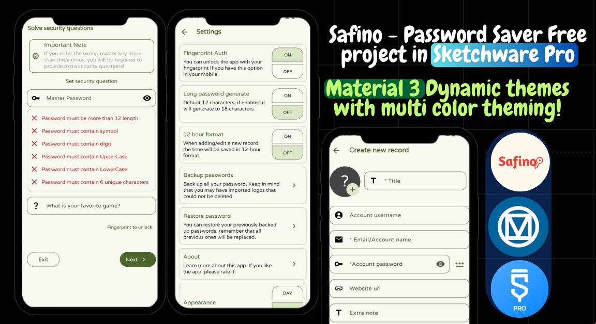

  

<h1 align="center">🔐 Safino – Offline Password Saver App</h1>

  
  Your private digital vault – beautifully designed, 100% offline, and fully customizable.  

  Built with ❤️ using Sketchware Pro & Android Studio  

---

## ✨ Features at a Glance

- 🚀 **Splash Screen** with API integration  
- 🗂️ **Password List** with advanced search  
- ➕ Add entries with:
  - 🖼️ Logo (via Storage Access Framework)
  - 📝 Title, account, username, password  
  - 🌐 Website & personal notes  
- ✏️ Edit | 🗑️ Delete | 📤 Share | 🔐 Secure View  
- 🔐 **Authentication**:
  - Fingerprint unlock  
  - Security question fallback  
- 💾 **Backup & Restore** (Offline only)  
- 🎨 **Dynamic Theming**:
  - Day/Night mode  
  - Full color customization  
  - Material 3 transitions  
- 🧼 **Material You UI** – modern and clean  
- ℹ️ About screen with developer credits

---

## 🛠️ Tech Stack

- 🧩 **Sketchware Pro** – visual block-based development  
- 🧠 **Android Studio** – for custom code & advanced tweaking  
- 💻 Java | XML | Android SDK  

---

## ❓ Why Safino?

Unlike cloud-based tools like Google Password Manager,  
**Safino stores everything 100% offline**, giving you total privacy and control.  

It’s also a powerful open-source foundation for:
- 🔧 Learning app development  
- ⚡ Publishing your own secure password manager  
- 💰 Selling a branded version  

---

## ▶️ How to Use & Setup

> ⚠️ **Warning:** Do **NOT enable** "Debug Logcat" — custom `Application` class in use.

### 1️⃣ Download & Restore  
- Clone or download the repo  
- Open the `.swb` file using Sketchware Pro

### 2️⃣ Customize the App  
- ✏️ Change app name and update `strings.xml`  
- 🔁 Replace the package name in:
  - All `.java` files  
  - `AndroidManifest.xml`  
- ℹ️ Edit "About" section with your info

### 3️⃣ Update Icon  
- Visit [icon.kitchen](https://icon.kitchen)  
- Generate and replace the app icon files

### 4️⃣ Add Custom Blocks  
- Add your custom blocks in **Sketchware Pro**  
- Build and test your APK

---

## 🔗 Demo

Click the image at the top or  
▶️ [Watch on YouTube](https://youtu.be/dB9tdkf1o7s)

---

## ✅ Usage & Distribution Policy

- ✅ **You Can:**
  - Use, modify, and publish your own version of the app  
  - Sell the **compiled APK**  
  - Use **any Java classes** from the project, however and wherever you want

- ❌ **You Cannot:**
  - Share or sell the original `.swb` project file  
  - Re-upload or showcase this `.swb` file on **any YouTube channel**  

> This project is for **learning**, **customization**, and **app publishing** — not for raw source redistribution.

---

## ♥️ Support & Donations

If you love Safino and want to support future projects:

- **Binance Pay ID:** `766720837`  
- Every donation helps fuel future open tools!  
- Thank you for your kindness and generosity ❤️

---

## 📄 License

This project is **free to use, edit, and distribute** for:

- ✅ Personal use  
- ✅ Educational use  
- ✅ Commercial use of the APK  
- ✅ Full freedom to reuse any Java code or class without restrictions

Just follow the policy: don’t reshare the `.swb` file, especially on YouTube.

---

## ⭐ Get Involved

- 🌟 Star this repo to support the creator  
- 🛠️ Submit feature requests or improvements  
- 📤 Share your own versions with no credits

---

> “Build it. Brand it. Publish it. Learn from it. Safino is yours to shape.”
